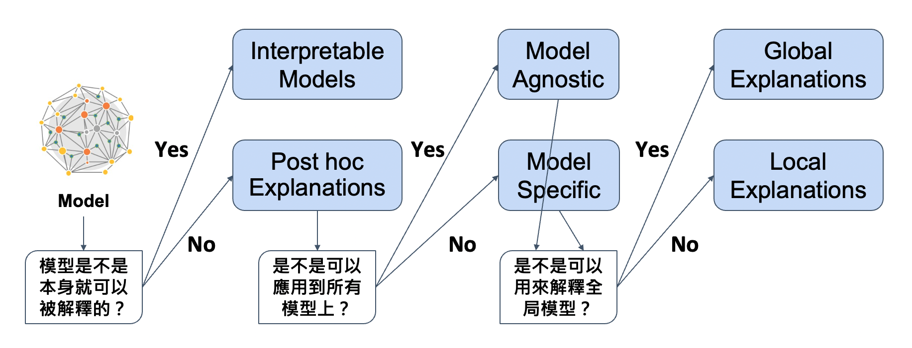

# Explainable AI (XAI) 
###### tags: `XAI`

## Machine Learning
- [x] 00. Data Exploration
- [x] 01. Intrinsically Interpretable Models
- [x] 02. Local Interpretable Model-agnostic (LIME)
- [x] 03. SHapley Additive exPlanations (SHAP) - Tree SHAP
- [x] 04. SHapley Additive exPlanations (SHAP) - Kernel SHAP

## Deep Learning
- [x] 01. Perturbation-Based
    - [x] Occlusion Sensitivity (Zeiler & Fergus 14)
- [x] 02. Gradient-Based
    - [x] Sensitivity Analysis (Simonyan et al. 14)
    - [x] SmoothGrad (Smikov et al. 17)
    - [x] Integrated Gradients (Sundararajan et al. 17)
- [x] 03. Propagation-Based
    - [x] LRP (Bach et al. 15)
- [x] 04. CAM-Based
    - [x] Grad-CAM (Ancona et al. 16)
    - [x] Layer-CAM (Peng-Tao et al. 21)
    
## Reference:
* [deepfindr: xai-series](https://github.com/deepfindr/xai-series)
* [keisen: tf-keras-vis](https://github.com/keisen/tf-keras-vis)

## Kaggle
* [Machine learning explainability](https://www.kaggle.com/learn/machine-learning-explainability)

